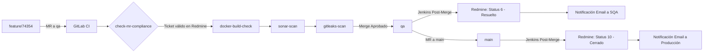

# 🛡️ Control de Asistencia — Mega Soft (v1.2)

Sistema de Control de Asistencia y Gestión de Accesos (PWA + Kiosco Biométrico Facial).

---

## 🏗️ Arquitectura del Sistema

* **Backend**: FastAPI (Python 3.11+) + MongoDB (Motor Async Driver) + JWT Auth + SlowAPI Rate Limiter
* **Frontend**: React PWA (CRA + Craco) + TailwindCSS + Shadcn/UI + face-api.js (Reconocimiento Facial en Browser)
* **Web Server / Reverse Proxy**: Nginx con SSL/TLS 1.3, CSP, HSTS, Gzip y hardening de seguridad
* **Orquestación**: Docker & Docker Compose

---

## 🔒 Ajustes de Seguridad y Privacidad (DevSecOps Hardening)

1. **Endpoints de Kiosco Protegidos (`/api/kiosk/roster`)**:
   * Requiere token Bearer con rol `kiosk` o `admin`.
   * **Privacidad de PII**: Se excluyeron la cédula, cargos, roles y departamento de la respuesta del roster.
   * **Aislamiento por Sede**: Los kioscos solo reciben los rostros de los usuarios pertenecientes a su sede correspondiente.
   * Endpoint oculto del esquema público OpenAPI (`include_in_schema=False`).

2. **Seguridad Web (Nginx)**:
   * Header **Content-Security-Policy (CSP)** restrictivo.
   * **HSTS** (Strict-Transport-Security) forzado a 1 año.
   * `X-Frame-Options: DENY` (Anti-Clickjacking).
   * `Permissions-Policy` deshabilitando APIs no usadas.
   * `server_tokens off` y `autoindex off` para evitar fingerprinting y exploración de directorios.
   * Bloqueo de acceso directo a archivos `.env`, `.git`, `.yml`, `.toml`, `.py` y configuraciones.

3. **Privacidad del Repositorio (`.gitignore`)**:
   * Ocultamiento automático de carpetas internas de documentación, memoria del proyecto, manuales y datos de prueba (`handoff/`, `memory/`, `manual/`, `seed/`, `.emergent/`).

---

## 🚀 Despliegue con Docker (Paso a Paso)

### Requisitos previos:
* Docker Engine 24.0+ y Docker Compose v2
* Certificados SSL (`fullchain.pem` y `privkey.pem`) en `/opt/ssl` (o la ruta configurada en `docker-compose.yml`)

### 1. Configurar variables de entorno

Copia la plantilla de ejemplo para el backend:

```bash
cp backend/.env.example backend/.env
```

Edita `backend/.env` con los valores correspondientes:

```env
MONGO_URL=mongodb://mongo:27017
DB_NAME=megasoft_asistencia
JWT_SECRET=tu_jwt_secret_super_seguro_aqui
JWT_ACCESS_MINUTES=720
APP_TIMEZONE=America/Caracas
ADMIN_EMAIL=admin@megasoft.com.ve
ADMIN_PASSWORD=TuPasswordSeguro123!
```

### 2. Construir e Iniciar los Contenedores

Para iniciar en segundo plano (detached mode):

```bash
# Definir URL pública para el frontend si aplica
export REACT_APP_BACKEND_URL="https://asistencia.tudominio.com"

# Desplegar los servicios (Mongo + Backend + Frontend)
docker compose up -d --build
```

### 3. Verificar estado de los servicios

```bash
docker compose ps
docker compose logs -f
```

---

## 🔄 Flujo de Integración Continua (DevSecOps Pipelines)

El proyecto utiliza un esquema híbrido de validación **Pre-Merge (GitLab CI)** y trazabilidad **Post-Merge (Jenkins)**.

### Diagrama del Flujo DevSecOps:



### Etapas de Pipeline:
1. **Pre-Check**: Valida el formato de la rama (`feature/<id>`, `hotfix/<id>`, `bugfix/<id>`) y verifica la existencia del ticket en Redmine mediante API.
2. **Build**: Verifica que las imágenes Docker compilen limpiamente.
3. **Quality**: Escaneo de código con **SonarQube** para Python y JavaScript.
4. **Security**: Búsqueda de credenciales o secretos expuestos mediante **Gitleaks**.
5. **Post-Merge**: Actualización de estados en Redmine y envío de notificaciones por correo al equipo.

---

## 📤 Guía para Subir el Código a GitLab

Para subir tus cambios en cumplimiento con las reglas del pipeline y asociados al ticket **#74354**:

### Paso 1: Crear la rama con la nomenclatura requerida

```bash
git checkout -b feature/74354
```

### Paso 2: Agregar los cambios y realizar el Commit

```bash
git add .
git commit -m "feature/74354: Ajustes de DevSecOps, hardening de seguridad y documentación"
```

### Paso 3: Configurar el Remote e Iniciar el Push

```bash
git remote set-url origin https://gitlab.megasoft.com.ve:8443/gsi/control-de-asistencia.git
git push -u origin feature/74354
```

### Paso 4: Crear el Merge Request en GitLab
1. Ingresa a GitLab y abre un **Merge Request**.
2. **Origen**: `feature/74354`
3. **Destino**: `qa` (o la rama indicada según el ciclo)
4. El pipeline ejecutará automáticamente las verificaciones de seguridad antes de permitir el merge.
